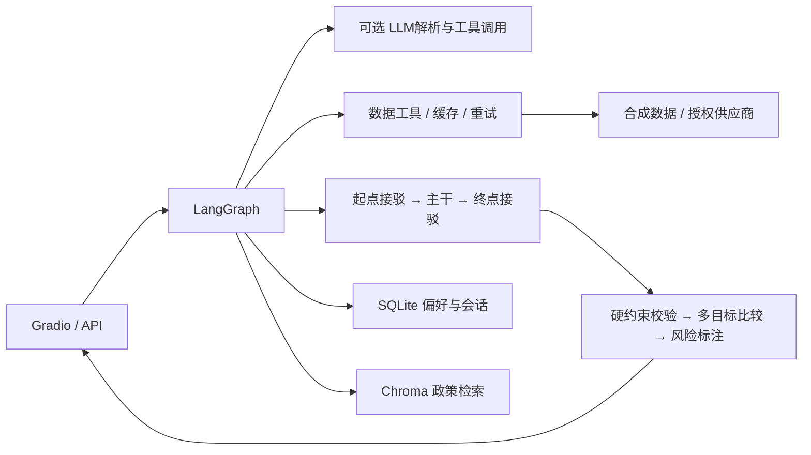
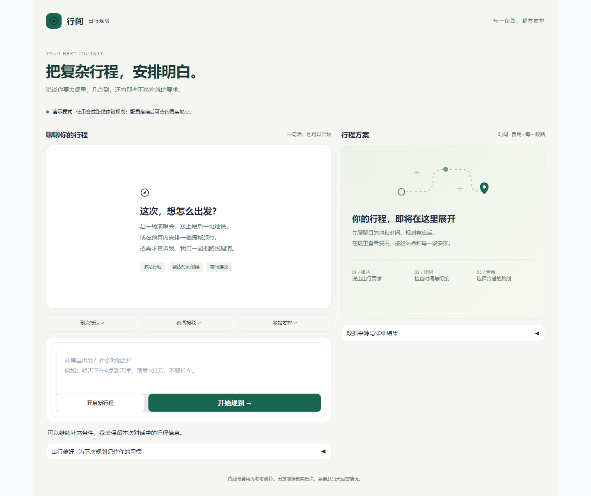

# 多约束混合交通出行 Agent

[](https://github.com/tsuimon/travel-planner-agent/actions/workflows/ci.yml)

项目地址：[github.com/tsuimon/travel-planner-agent](https://github.com/tsuimon/travel-planner-agent)

将自然语言需求转换为结构化约束，用程序校验班次衔接、预算和交通方式，再输出可比较的混合出行方案。

**定位：可运行、可测试的研究原型。** 未配置高德时使用合成交通演示；配置高德后，自然语言单程和多站请求查询真实地图路线，支持自动选择地铁下车换打车的站点。票务库存、天气仍需另接供应商；地图票价和打车估价不等于可预订报价，也不承诺全国覆盖或全局最优。

## 核心特性

- 自然语言解析与澄清；预算、时间窗、禁用方式为硬约束。
- 多站活动草稿与连续追问，按顺序计算活动时长、累计预算和后续交通；可接 DeepSeek 与高德地点候选。
- 城市间主干 + 城内接驳分层搜索；时间、费用、换乘三种目标生成候选。
- 夜间专门探索“可赶上的公共交通 + 短途接驳”，允许时保留直达打车对照。
- 已接高德时，输入“先坐地铁，然后打车”，程序自动搜索下车站、检查末班并按总估价推荐站点，无需用户先选站。
- LangGraph 六节点工作流、最多6轮、8000 Token预算、30秒规划deadline、工具重试与缓存。
- SQLite偏好与会话记忆；本次偏好与长期偏好分开。
- Chroma + LangChain Embeddings离线政策检索，展示官方来源、施行日期与复核日期。
- FastAPI API、Gradio聊天与偏好面板、合成数据上的八类端到端测试。



技术栈：Python 3.10+（本机已验证3.12）、LangGraph、LangChain Core、Pydantic 2、SQLAlchemy 2、SQLite、Chroma、httpx、FastAPI、Gradio、pytest。

## 界面预览



桌面端并排显示对话与方案，手机端自动切换为单列。支持快捷场景、行程时间轴、费用摘要、折叠偏好及请求失败后的重试。图片为演示模式界面，功能与数据边界见上文说明。

## 快速开始（Conda，3步）

在 **Anaconda Prompt** 中进入本目录：

1. 创建环境：`conda env create -f environment.yml`
2. 激活环境：`conda activate travel-planner`
3. 启动：`python -m uvicorn src.api.app:app --host 127.0.0.1 --port 8000`

访问 [对话界面](http://127.0.0.1:8000/ui) 或 [API文档](http://127.0.0.1:8000/docs)。数据库与知识库自动初始化，无需API Key。`.env.example` 是可选配置模板，不要把真实密钥写进源码。

**本机环境已经创建**：`D:\anaconda3\envs\travel-planner`，直接从第2步开始。PowerShell未初始化Conda时可用：

```powershell
& 'D:\anaconda3\Scripts\conda.exe' run -n travel-planner --no-capture-output python -m uvicorn src.api.app:app --host 127.0.0.1 --port 8000
```

## 效果演示

安卓客户端已提供：[安装、连接与构建说明](docs/android.md)。安装包位于 `dist/travel-planner-0.1.0.apk`；电脑执行 `python -m scripts.start_mobile` 后，手机可在同一可信Wi-Fi内连接。APK依赖后端运行，不是离线规划程序。

配置高德后可直接输入：`10点半从鸟巢出发，去前往北京印刷学院，四号线赶不上了，先坐地铁，然后打车，给我花费最低的方案`。程序明确标注晚上22:30的理解，自动选择下车站，输出地铁与打车两段及费用依据。站点来自当次查询，没有写死案例答案。算法与边界见[主动规划说明](docs/intelligent-planning.md)。

下表交通案例用于未配置高德的合成演示模式：

| 输入 | 可验证行为 |
|---|---|
| 明天晚上从北京海淀到天津滨海新区，预算50元，不要打车 | 返回预算内公共交通组合，不含打车 |
| 明天22:40从夜间起点到夜间终点，预算100元，能骑共享单车，这次可以打车 | 公共交通接驳与直达打车对比 |
| 明天上午8:00从甲县到乙县，预算100元 | 县域班车 → 高铁 → 县域班车 |
| 高铁能带充电宝吗 | 检索铁路条目并附12306来源 |
| 记住，我不想打车 | 保存偏好；后续请求自动应用 |

运行 `python -m scripts.demo` 会将结果写入 `data/demo-results.json`。时刻表中的 `DEMO-*`、示例城、甲乙县均为合成案例。

## 验证与部署

```bash
python -m pytest -q
python -m ruff check src frontend scripts tests
python -m pip check
docker compose up --build
```

Docker同样仅映射到本机8000端口。[测试报告](docs/verification.md)记录实际运行结果及尚未验证的部分。

## 设计思考与边界

1. 原设计最大的风险是数据供给，其次是约束语义和搜索剪枝。完整评审见[整体架构设计](docs/architecture.md)。
2. 图搜索保留多个时间/成本标签，不用单个visited节点记录误删可行接续；Top-K与资源上限仍会损失最优性。
3. 无结果不等于客观不可达；降级时只输出已校验候选或缺数据说明。任何场景都不为凑齐三套方案而放宽禁用方式或预算。
4. 本地RAG采用可复现的字符n-gram哈希向量，实现LangChain Embeddings接口；它是词法基线，不伪装成预训练语义模型。答案使用检索片段与引用确定性拼接。
5. LLM接入可选，默认规则解析完成演示。可选模型参与需求结构化和function calling，班次、费用和最终排序均由程序产生。
6. 本项目为本地单用户服务，未实现多租户账户体系、支付、SSE、实时定位和真实票务预订。

## 文档导航

- [架构与可行性评审](docs/architecture.md)
- [Phase 0–7阶段说明](docs/phases.md)
- [分阶段完整代码快照](docs/phase-code.md)
- [模块与搜索设计](docs/modules.md)
- [API接口](docs/api.md)
- [供应商网关契约](docs/providers.md)
- [DeepSeek、高德、同程 API 申请与配置](docs/api-setup.md)
- [主动规划、全程比较与真实路线证据](docs/intelligent-planning.md)
- [复杂需求理解、连续对话与场景验收](docs/semantic-understanding.md)
- [Conda与Docker部署](docs/deployment.md)
- [实际验证记录](docs/verification.md)

原始设想文档保留未改动。其中的完成勾选、性能提升比例和简历话术不代表本项目实测结果。
