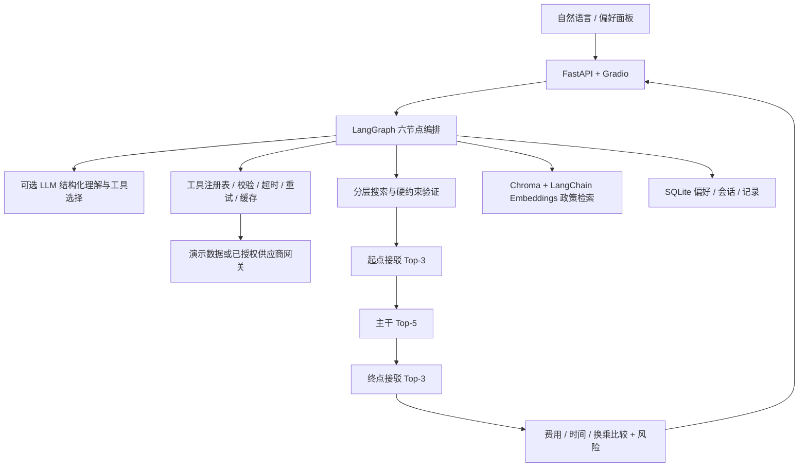
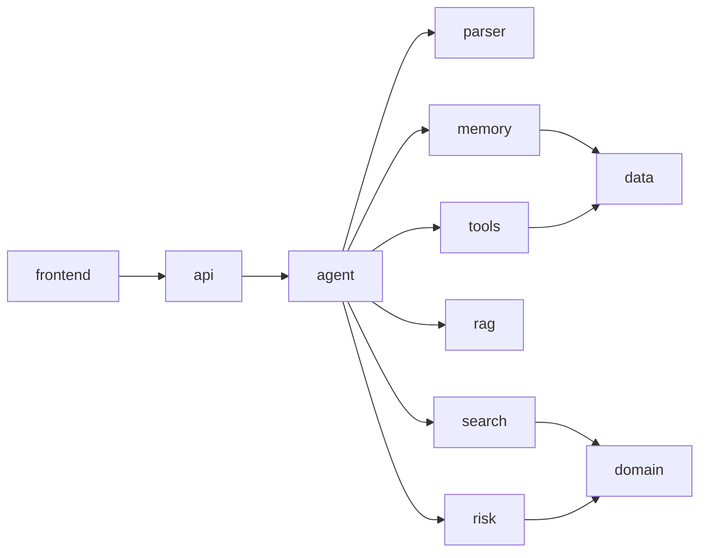
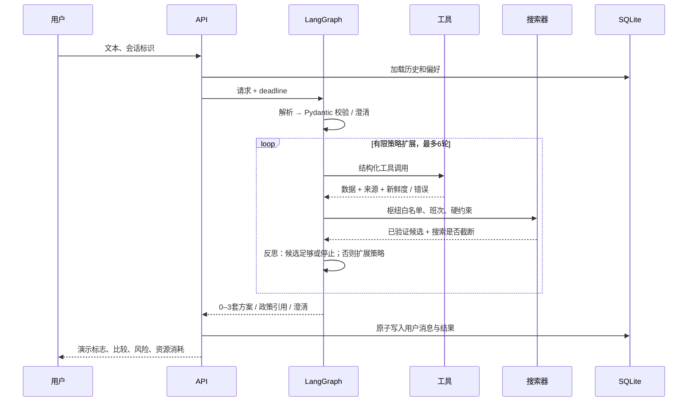

# 整体架构设计与可行性评审

## 判断：可以实现研究原型，尚不能承诺全国实时导航

原文 `天马行空的设想.md` 保留为需求来源。当前仓库原本只有这一份文档，没有已完成的代码、测试或数据授权。本文是实施依据。

| 原设想 | 评审与修订 |
|---|---|
| 混合 LLM + 程序搜索 | 可行；语言理解与确定性校验分离 |
| 一张图做 A* 绝对不可行 | 过度绝对化。复杂度取决于图规模、启发式、时间表示和剪枝；本项目选分层以限制规模 |
| 每节点保留一个最低费用记录 | 不正确。较贵但更早抵达的标签可能赶上唯一接续；需保留时间、费用、换乘等多维标签 |
| 只改变堆排序即可获得多目标 Top-K | 不成立。实现有界多标签搜索，再产生不同目标候选；截断后只保证候选集内排序 |
| 最近仍运营地铁站 | 必须在可达时刻、方向和服务日上可乘，空间最近不等于最优；枚举可达公共交通终点再接驳 |
| 夜间强制两套含打车方案 | 硬排除与预算优先；不足两套就返回实际数量，禁止凑数 |
| 超时降级到高铁 + 打车 | 仅返回已校验候选，否则说明缺数据或未找到；不能制造班次或放宽硬约束 |
| 单点超时检查 / Token 超限后截断 | 为全链路设置绝对 deadline；每次模型调用前预留 Token，调用后记账；同步搜索协作检查 deadline |
| 12306 / 飞猪 API 可直接用 | 没有提供授权和接口合同；实现演示数据及带校验的供应商网关协议，不声称已接入实时售票 |
| 共享单车随时可用 | 只有候选连接，不代表有车；标注库存未知、夜间覆盖不确定 |
| 北京到上海 50 元不可能 | 数据不全时只能说当前覆盖内未找到；证明不可行需完整数据或可靠下界 |
| 自动记住所有话语 | 当前请求覆盖历史；“这次”不写长期记忆；明确偏好可保存、修改、删除 |
| 已完成勾选、异常率 <5%、准确率 +40%、Token -60% | 原文无证据，不作为交付或简历事实 |
| 高德只有省时/省钱两种模式 | 官方路径文档有多种策略；产品差异应通过固定案例对照实测 |

## 架构图

## 模块关系图

## 数据流图

## 数据与搜索约定

- 金额使用整数分；时间使用带时区 datetime，默认 Asia/Shanghai。班次含绝对服务日期，频率边用分钟偏移表示跨午夜运营段。
- 边需包含来源、是否演示、抓取时间、座位状态；未知库存不能表述为保证可执行。
- 主干与本地子图分开。先计算起点可达枢纽，再按实际抵达时间搜索主干，最后按主干抵达时间搜索目的地接驳。
- 出发时间窗约束的是完整方案第一次出发；中间段允许在窗口后出发。总耗时为末段抵达减首段出发，含等待。
- 不同车次/服务算换乘，同车连续边不重复计数。默认换乘缓冲15分钟；飞机登机缓冲至少90分钟。真实站内步行仍需供应商提供。
- 多标签状态保留抵达、成本、换乘、骑行与步行资源、已访问集合和末次服务。当前不做跨路径支配剪枝，以保留替代路线；小图可枚举，达到Top-K/扩展上限时明确返回截断标志。
- 夜间专门枚举公共交通可达终点，接 taxi/bike/walk 后缀，并在允许时保留直达 taxi 对照；每段仍通过统一时刻与约束验证。
- Top-K 和枢纽裁剪会丢失全局最优性；本项目仅称“覆盖数据和搜索限制内的候选方案”。

## 实施与验收

Phase 0 配置与工程 → 1 持久化与缓存 → 2 工具契约 → 3 搜索 → 4 状态图 → 5 RAG与记忆 → 6 API与UI → 7 回归与部署。逐阶段文件索引、验证命令和完整源码见 `phases.md` 与 `phase-code.md`。

默认 demo 模式无需外部密钥，班次全部为合成数据；live 模式必须配置供应商网关，不回退到演示时刻表。默认本地单用户运行，多租户认证、支付和实时导航不在本原型中。

## 核验来源

- [LangGraph Graph API](https://docs.langchain.com/oss/python/langgraph/graph-api)：节点、状态和条件边。
- [高德路线搜索](https://developer.amap.com/api/javascript-api/reference/route-search)：公交策略及首末班字段；不能据此推断所有 App 场景表现。
- [12306 铁路携带物品目录](https://www.12306.cn/mormhweb/mobile_zxdt/202206/t20220617_37625.html)：政策知识库的铁路充电宝条目来源，2022-07-01施行。
- [Chroma 数据写入](https://docs.trychroma.com/docs/collections/add-data)：使用自行计算的 embeddings 与文档、metadata 一并入库。

核验日期：2026-09-14。来源更新与真实出行数据验收是持续工作，不能由一次演示代替。
